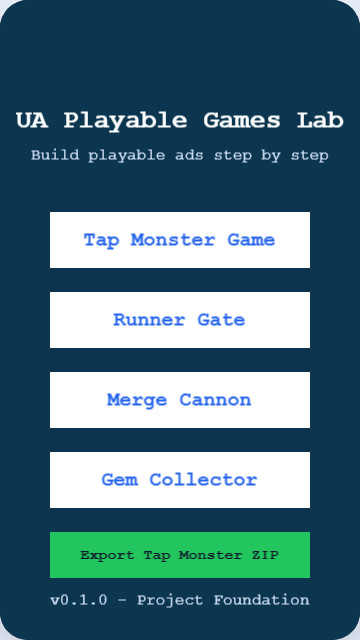
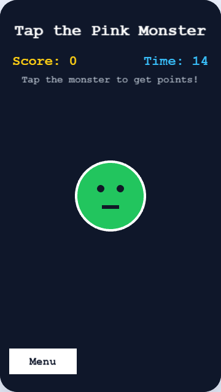
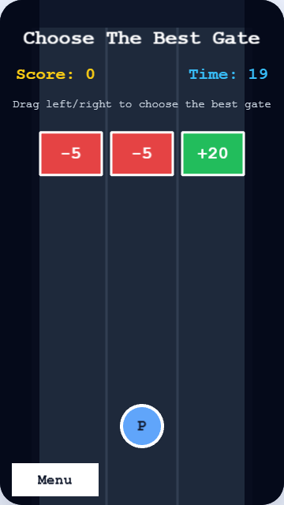
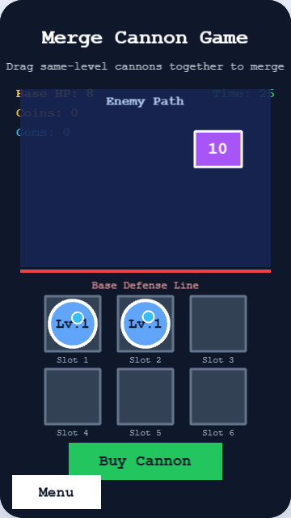
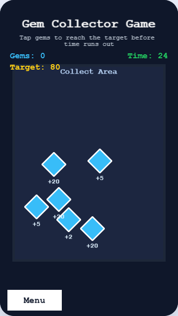

# UA Playable Games Lab

A beginner-friendly HTML5 playable ads learning project built with **Vite**, **TypeScript**, and **Phaser 3**.

This project contains multiple small playable ad prototypes designed to help me learn the core mechanics used in mobile UA playable ads: tap interaction, drag control, collision, merge mechanics, rewards, timers, end cards, CTA buttons, and HTML5 export.

---

## Project Status

| Version | Feature                 | Status |
| ------- | ----------------------- | ------ |
| v0.1.0  | Project Foundation      | Done   |
| v0.2.0  | Tap Monster Game        | Done   |
| v0.3.0  | Runner Gate Game        | Done   |
| v0.4.0  | Merge Cannon Game       | Done   |
| v0.4.5  | Refactor & Architecture | Done   |
| v0.5.0  | Gem Collector Game      | Done   |
| v0.6.0  | Export HTML5 Playable   | Done   |
| v0.7.0  | Portfolio Polish        | Done   |
| v0.7.0  | Playable Framework      | Done   |

---

## What is UA Playable Ads?

UA means **User Acquisition**.

Playable ads are interactive ads that let users try a small playable experience before they install a game, visit a landing page, or click a CTA.

A typical playable ad includes:

- Intro screen
- Short interactive gameplay
- Reward feedback
- Timer or goal
- End card
- CTA button
- Replay button

---

## Tech Stack

- Vite
- TypeScript
- Phaser 3
- HTML
- CSS
- JSZip
- Git / GitHub

---

## Features

### Playable Game Prototypes

- Tap Monster
- Runner Gate
- Merge Cannon
- Gem Collector

### Gameplay Mechanics

- Tap/click interaction
- Drag movement
- Drag-and-drop merge
- Collision detection
- Projectile targeting
- Enemy HP
- Reward system
- Timer system
- End card flow
- CTA button
- Replay button

### Export

- Export Tap Monster as standalone HTML5 ZIP
- Generated files:
  - `index.html`
  - `style.css`
  - `playable.js`
  - `README_EXPORT.txt`

---

## Screenshots

> Screenshots will be added as the project becomes portfolio-ready.

### Main Menu



### Tap Monster



### Runner Gate



### Merge Cannon



### Gem Collector



---

## How to Run

Install dependencies:

```bash
npm install
```

Run development server:

```bash
npm run dev
```

Build project:

```bash
npm run build
```

---

## Folder Structure

```text
ua-playable-games-lab/
|-- screenshots/
|-- src/
|   |-- main.ts
|   |-- styles.css
|   `-- game/
|       |-- colors.ts
|       |-- config.ts
|       |-- sceneKeys.ts
|       |-- scenes/
|       |   |-- MenuScene.ts
|       |   |-- TapMonsterScene.ts
|       |   |-- RunnerGateScene.ts
|       |   |-- MergeCannonScene.ts
|       |   |-- GemCollectorScene.ts
|       |   `-- EndCardScene.ts
|       |-- systems/
|       |   `-- ExportSystem.ts
|       `-- ui/
|           |-- createTextButton.ts
|           `-- showFloatingText.ts
|-- README.md
|-- CHANGELOG.md
|-- package.json
`-- vite.config.ts
```

---

## Game Prototypes

### v0.2.0 - Tap Monster Game

Tap Monster teaches the most basic playable ad interaction.

#### Flow

1. Player opens the main menu.
2. Player chooses Tap Monster.
3. Monster appears on screen.
4. Player taps the monster.
5. Score increases.
6. Monster moves to a random position.
7. Timer counts down.
8. End card appears.
9. Player can replay or click CTA.

#### Concepts

- Phaser scene
- Tap/click input
- Score system
- Timer system
- Random positioning
- Tween animation
- End card
- CTA button

### v0.3.0 - Runner Gate Game

Runner Gate teaches drag movement and gate choice mechanics.

#### Flow

1. Player drags left and right.
2. Gates move downward.
3. Player chooses gates such as +10, +20, +50, x2, -5.
4. Score changes based on selected gate.
5. Timer ends.
6. End card appears.

#### Concepts

- Drag input
- Lane movement
- Spawning objects
- Collision detection
- Score modifiers
- End card reuse

### v0.4.0 - Merge Cannon Game

Merge Cannon teaches drag-and-drop, merge mechanics, enemy HP, and auto shooting.

#### Flow

1. Player starts with two level-1 cannons.
2. Player drags same-level cannons together.
3. Cannons merge into higher-level cannons.
4. Enemies spawn and move downward.
5. Cannons auto shoot projectiles.
6. Enemies lose HP.
7. Player earns coins and gems.
8. Timer or base HP ends the game.

#### Concepts

- Drag and drop
- Merge mechanic
- Enemy HP
- Projectile movement
- Auto targeting
- Reward system
- Base HP
- Timer ending

### v0.5.0 - Gem Collector Game

Gem Collector teaches collectible objects, respawn logic, and target score conditions.

#### Flow

1. Gems spawn randomly.
2. Player taps gems.
3. Gems increase score.
4. Gems disappear with animation.
5. New gems respawn.
6. Player reaches target or timer ends.
7. End card appears.

#### Concepts

- Collectible objects
- Respawn system
- Target score
- Floating reward text
- End card reuse

### v0.6.0 - Export HTML5 Playable

This version introduces the first standalone playable export.

#### Exported Package

```text
tap-monster-playable.zip
|-- index.html
|-- style.css
|-- playable.js
`-- README_EXPORT.txt
```

#### Concepts

- HTML5 playable structure
- JSZip
- Browser download
- Standalone playable
- CTA and replay outside dev environment

---

## Architecture Notes

### Scene Keys

Scene names are stored in one place:

```ts
SceneKeys.Menu;
SceneKeys.TapMonster;
SceneKeys.RunnerGate;
SceneKeys.MergeCannon;
SceneKeys.GemCollector;
SceneKeys.EndCard;
```

This avoids hardcoded string mistakes.

### Shared Colors

Colors are stored in `GameColors`:

```ts
GameColors.background;
GameColors.green;
GameColors.blue;
GameColors.yellow;
GameColors.red;
```

This makes the code easier to read.

### Shared UI Helpers

Reusable helper functions:

```ts
createTextButton();
showFloatingText();
```

These reduce repeated code across scenes.

---

## Development Workflow

This project uses a version-based Git workflow.

Each feature is developed in a separate branch:

```bash
git switch main
git pull origin main
git switch -c feat/example-feature
```

After finishing:

```bash
npm run build
git add .
git commit -m "feat: add example feature"
git tag vX.X.X
git push -u origin feat/example-feature
git push origin vX.X.X
```

Then merge into main:

```bash
git switch main
git pull origin main
git merge feat/example-feature
git push origin main
```

---

## Version Roadmap

| Version | Goal                     |
| ------- | ------------------------ |
| v0.1.0  | Project Foundation       |
| v0.2.0  | Tap Monster              |
| v0.3.0  | Runner Gate              |
| v0.4.0  | Merge Cannon             |
| v0.4.5  | Refactor & Architecture  |
| v0.5.0  | Gem Collector            |
| v0.6.0  | Export HTML5 Playable    |
| v0.7.0  | Portfolio Polish         |
| v0.8.0  | Playable Framework       |
| v0.9.0  | MRAID / Ad Network Notes |
| v1.0.0  | Portfolio Release        |

---

## What I Learned

Through this project, I practiced:

- Phaser scene lifecycle
- TypeScript classes and types
- Game object management
- Input events
- Timers
- Tweens
- Collision detection
- Projectile movement
- Reward systems
- End card design
- HTML5 playable export
- Git version workflow

---

## Future Improvements

- Add sound effects
- Add mobile touch polish
- Add fullscreen preview
- Export more game templates
- Add MRAID notes
- Add playable size validation
- Add analytics event examples
- Add screenshots and demo video
- Deploy live demo with GitHub Pages or Vercel

---

## Disclaimer

This project is for learning and portfolio purposes only.

It does not use copyrighted game assets and does not copy any commercial game. The playable prototypes use simple original shapes and placeholder visuals.

Real ad network deployment may require extra work such as MRAID integration, click tracking, file size limits, orientation rules, and network-specific QA.

---

## v0.8.0 - Playable Framework

This version improves the internal architecture of the project.

### What Changed

- Added shared playable game types.
- Added a central `PlayableGameRegistry`.
- Updated the main menu to render game buttons from the registry.
- Added shared `startEndCard()` framework helper.
- Reused shared end card navigation across all playable games.

### Why This Matters

Before this version, each game button was hardcoded in `MenuScene.ts`.

After this version, games are defined in one central registry:

```ts
export const PlayableGameRegistry = [
  {
    id: 'tap-monster',
    title: 'Tap Monster',
    sceneKey: SceneKeys.TapMonster,
    version: 'v0.2.0',
    mechanics: ['Tap', 'Score', 'Timer', 'End Card', 'CTA'],
    status: 'done',
  },
];
```

The menu can loop through this registry and automatically create buttons.

This makes the project easier to extend when adding new playable ad prototypes.

### Concepts Learned

- Registry pattern
- Shared types
- Centralized game metadata
- Framework helper functions
- Data-driven menu rendering
- Cleaner scene navigation
